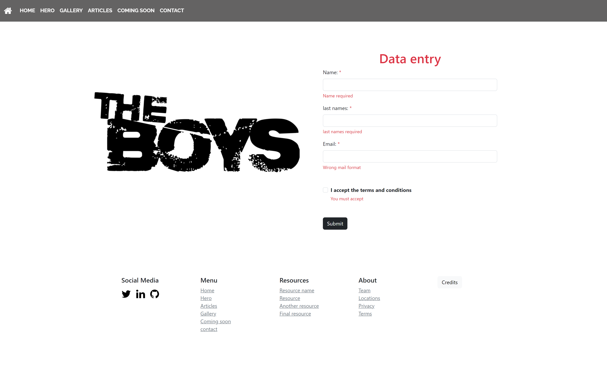

<h1>Memoria del proyecto fin de evaluación  de Lenguajes de Marcas - 1º DAW</h1>

<h1 id="indice">Indice</h1>
<ul>
  <li><a href="#introduccion">Introducción</a></li>
  <li><a href="#motivacion">Motivación</a></li>
  <li><a href="#estructura">Estructura</a></li>
  <li><a href="#estilo">Estilo</a></li>
</ul>

<h1 id="introduccion">Introducción</h1>

  > [!NOTE]
  > Proyecto final del primer trimestre de lenguajes de marcas ( DAW ), alumno Pablo Gil Diaz , Finalizada dia Lunes 11/12/2023  
  **Nombre del proyecto:** ActionTV - The boys
  
  >[!IMPORTANT]
  > **Proyecto inspirado en la serie de prime video '' THE BOYS '' Y '' GENV '' con fines totalmente educativos y sin ningún tipo de uso comercial**

<h1 id="motivacion">Motivación</h1>
El tema lo he elegido ya que me encanta mucho hacer proyectos inspirados en series que veo, en este caso tanto The boys como GenV la tengo muy reciente y no he podido evitar inspirarme en ella.

<h1 id="estructura">Estructura</h1>

- Hero section
- Introduccion
- Galería
- Artículos
- Próximamente
- Form
- Footer

> <h3> Hero Section </h3>

He utilizado una imagen de fondo tomada de wallpaper Abyss que se adapta fácilmente a diferentes dispositivos y comple todas las necesidades buscadas para este proyecto.  
Sobre ella he colocado un button estilado con un hover donde te lleva a la página de la serie en PRIMEVIDEO para buscar mas información.

> <h3>Introducción</h3>

En este caso he usado una estructura simple con imagenes estéticas y acordes al diseño para indicar una elección al usuario, ¿quieres ser un heroe o prefieres no serlo?

Seguido de esta introducción al maravilloso mundo de Theboys hago uso de un slide con un ancho del 100% para romper con el ancho establecido del wrapper main y darle cierto dinamismo al diseño
En donde aparece los protagonistas.  

> <h3>Artículos</h3>

Esta section de artículos empieza con una frase mítica del personaje HOMELANDER en theboys, la cual se hizo muy viral en tiktok por lo que representa esta escena. 
Dentro de esta sección nos vamos a encontrar cuatro cards con su respectiva preview de información seguida del botón donde, si quieres, puedes ampliar la información de este personaje
al igual que en el caso de la card de GENV.

> <h3>Próximamente</h3>

En esta section podemos ver las próxima temporada anunciada confirmada para 2024, he usado en ella un grid de 3 con un hoover en las imágenes y un enlance donde te lleva al trailer en youtube

> <h3>Form and Footer</h3>

> <h3>Modal</h3>

<h1 id="estilo">Estilo de la página</h1>

> <h3>Tipografía:</h3>
- **TÍTULOS**  // Raleway  
- **PARRAFOS**  // Roboto & Lato
  
> <h3>Paletas de color:</h3>
Tonos blancos ( #f2f2f2 )  
Tonos oscuros ( #141414 )  
Tonos resalte ( rgb(236, 32, 32) )   

<h1>Code snippets</h1>
He utilizado los siguientes:  

- Para la barra de navegación y el slide de la galería he dado uso de W3SCHOOLS " HOW TO "    // https://www.w3schools.com/howto/default.asp  
- Para el footer me he inspirado en este de codepen escogiendo los iconos y un poco la estética  // https://codepen.io/scanfcode/pen/MEZPNd  
- Para las fotografías he usado   // https://wall.alphacoders.com/by_sub_category.php?id=317706&name=The+Boys+Wallpapers

# Enlace Proyecto
https://envyx10.github.io/TheboysBoostrap/indexBoostrap.html

